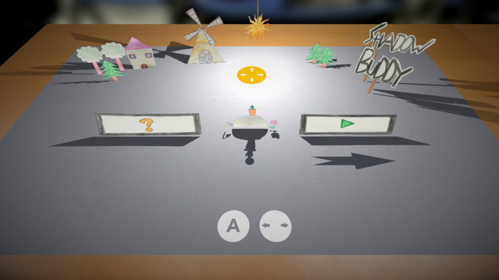

# ShadowBuddy

Shadow Buddy is a cooperative multiplayer game in a pop-up book style environment. Player one is controlling a little dot and has to jump from one page of the book to the next, while player two is the sun and can control all the shadows through changing its position. Since player one can only walk on shadows, the two players have to work together to proceed.

Made during the [5th Klagenfurt GameJam](https://www.itec.aau.at/gamejam/).

## [Play on itch.io!](https://kruemelkatze.itch.io/shadow-buddy)

### [Download Executable](./Releases).

